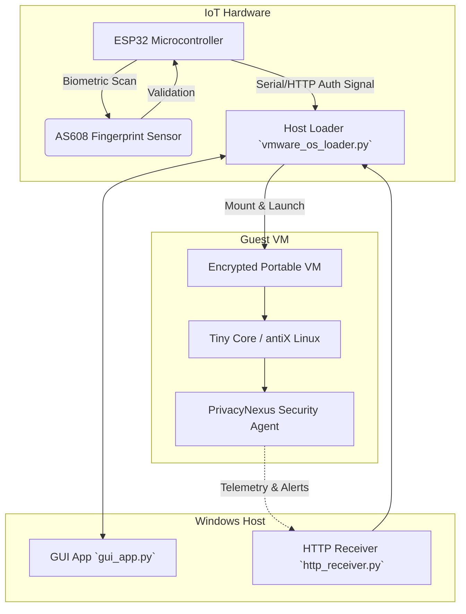

# PrivacyNexus

[](https://www.python.org/)
[](https://platformio.org/)
[](https://www.espressif.com/en/products/socs/esp32)
[](LICENSE)
[](#architecture)

## 📌 Executive Overview

**PrivacyNexus** is a Biometric-Authenticated Portable Secure OS and Workspace Architecture developed as a Final Year Research Project. It provides a secure, portable computing environment by combining hardware-level biometric authentication, an encrypted portable virtual machine (VM) guest, and host-side orchestration.

By linking an ESP32 microcontroller with an AS608 optical fingerprint sensor to a Windows host loader, PrivacyNexus ensures that the secure workspace (running Tiny Core or antiX Linux) is only accessible to authorized users.

---

## 🏗️ System Architecture

PrivacyNexus operates across three interconnected layers: IoT Hardware, Host OS, and Guest OS.



### Workflow Breakdown
1. **Biometric Authentication:** The user authenticates via the ESP32 + AS608 sensor.
2. **Authorization Dispatch:** Upon success, the ESP32 dispatches a secure authorization signal to the host.
3. **Host Orchestration:** The `gui_app.py` displays progress, while `vmware_os_loader.py` verifies hardware state and securely mounts the encrypted portable VM.
4. **Secure Execution:** The VM boots, running the internal Security Agent for monitoring.

---

## 📂 Project Directory Structure

```text
PrivacyNexus/
├── vmware_os_loader.py      # Windows host-side launcher & VM orchestrator
├── gui_app.py               # Desktop user interface (CustomTkinter)
├── http_receiver.py         # Local communication listener for telemetry
├── build_executables.py     # PyInstaller script for host packaging
├── requirements.txt         # Python dependencies
├── platformio.ini           # PlatformIO configuration for ESP32
├── src/                     # ESP32 firmware source code
│   └── main.cpp             # Embedded biometric verification logic
└── HDD/                     # [IGNORED] VMware virtual disk images (See Setup)
```

> [!WARNING]
> The `HDD/` directory containing the VMware virtual disk images is intentionally excluded from version control due to file size constraints. You must set this up manually.

---

## ⚙️ Prerequisites

Before setting up PrivacyNexus, ensure you have the following installed:
- **Python 3.x:** (with `pip`)
- **VMware:** VMware Workstation Pro or VMware Workstation Player
- **PlatformIO:** For building and flashing ESP32 firmware (VS Code extension recommended)
- **Hardware:** ESP32 Development Board, AS608 Optical Fingerprint Sensor, USB Cables, Jumper Wires.

---

## 🔌 Hardware Setup (ESP32 + AS608)

Connect your AS608 fingerprint sensor to the ESP32 using the following typical pinout. Please verify against your specific board's documentation.

| AS608 Pin | Description | ESP32 Pin (Default) |
| :--- | :--- | :--- |
| **VCC** | Power (3.3V) | `3V3` |
| **TX** | Transmit | `RX2` (GPIO 16) |
| **RX** | Receive | `TX2` (GPIO 17) |
| **GND** | Ground | `GND` |
| **WAK** | Wakeup / Touch | (Optional/Unused in basic setup) |
| **3.3V**| Sensor Power | (Often connected to VCC) |

*Check `src/main.cpp` or relevant configuration files if you modified the serial pins.*

---

## 🚀 Getting Started & Local Setup

### 1. Clone the Repository
```bash
git clone https://github.com/OvindaSakun/PrivacyNexus.git
cd PrivacyNexus
```

### 2. Python Environment Setup
It's recommended to use a virtual environment:
```bash
python -m venv venv
venv\Scripts\activate
pip install -r requirements.txt
```

### 3. Hardware Firmware Flashing
Open the project in VS Code with the PlatformIO extension installed.
1. Connect your ESP32 via USB.
2. Build and upload the firmware using the PlatformIO interface or CLI: `pio run -t upload`.

### 4. VM Configuration (The `HDD/` Directory)
Create an `HDD` directory in the root of the project to house your VM files.
```bash
mkdir HDD
```
Place your configured VMware `.vmx` and `.vmdk` files (Tiny Core or antiX Linux) into this `HDD` directory. Ensure `vmware_os_loader.py` is pointing to the correct `.vmx` path.

### 5. Running the Application
Launch the graphical interface to start the host loader sequence:
```bash
python gui_app.py
```
*(Alternatively, build standalone executables using `python build_executables.py` and run the resulting `.exe`)*

---

## 🔗 Related Repositories

PrivacyNexus relies on an internal ML-driven Data Loss Prevention (DLP) and Host-based Intrusion Detection System (HIDS) running inside the guest Linux environment.

This agent is maintained in a dedicated companion repository:

👉 **[PrivacyNexus-Agent Repository](https://github.com/OvindaSakun/PrivacyNexus-Agent)**

Be sure to clone and configure the Security Agent inside your Guest VM as part of a complete deployment.

---
*Created by [Ovinda Sakun](https://github.com/OvindaSakun)*
